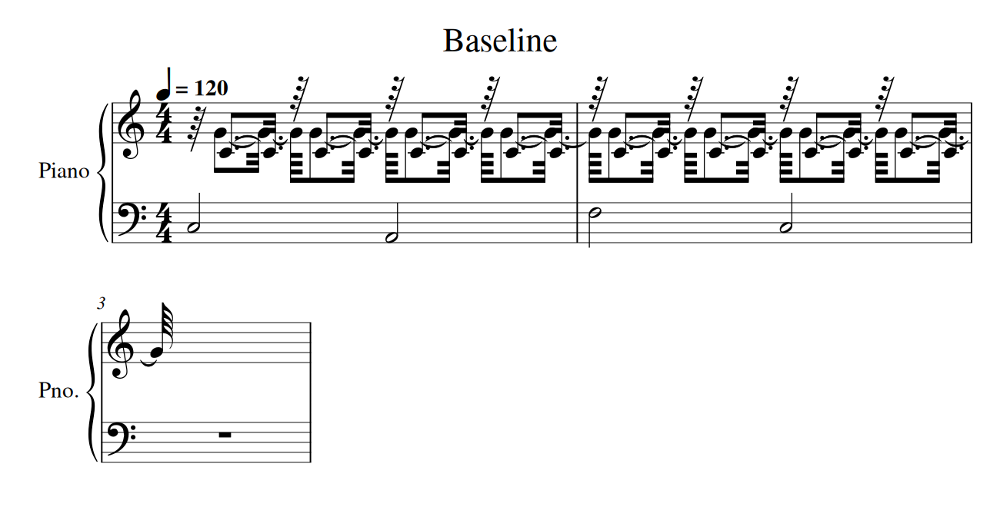
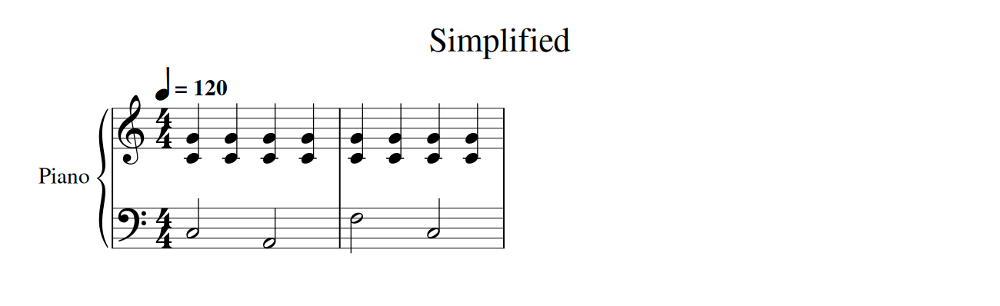

# Simple score review — 11 September 2026

Reviewed main at `54b6b37`. Public `/api/health` reported `quantization_mode=performance`, `hand_separator=viterbi`, and `nextgen.pipeline_mode=legacy` with the orchestrator inactive. The default solo route uses Basic Pitch; polyphonic/quality reports MT3 available through RunPod. A health response does not establish the deployed commit or prove successful transcription of a recording.

Both the legacy job route and the new live orchestrator ultimately use `UnderstandingPipeline` and the same performance notation engine. These fixes apply to that shared engine; enabling the new orchestrator is not required to benefit from them after deployment.

## Findings and changes

- **Overly literal rhythm:** small onset deviations competed too successfully against simple beats, creating 32nd/64th notation. The bounded rhythm search now gives common binary values a small jitter tolerance. Fine rhythms and tuplets remain candidates, and attacks must remain strictly ordered within each inferred line. Integer attacks in a triplet figure inherit the neighboring triplet context for release spelling.
- **Release noise became notation:** a 0.93-quarter release could become tied fragments and a tiny rest. Prefer a simple nearby named duration within at most 0.10 quarter beats and 20% of the original duration. Real short notes, short rests and sustained independent voices remain supported.
- **Dyads became two voices:** the voice separator split a fifth/octave based on pitch distance alone. The performance path now prefers a shared chord voice when durations and roles agree. Explicitly supplied voices remain authoritative; legacy separator defaults stay available. Its small overlap grace handles slight release jitter.
- **Opening phrases collapsed:** independently clamping every negative beat to zero turned several early attacks into a chord. Extend the audio time map backwards, and use a shared translation for direct note conversion. Rubato intervals remain intact. Measured downbeats establish bar phase only when their quarter-beat units match the selected meter and their positions are consistent. Unknown phase is not inferred from the first note.
- **Contextual hands were discarded:** an isolated attack inside a phrase could be relabeled ambiguous, then rendered using middle C. Keep the Viterbi path for phrases and preserve low confidence separately. A truly isolated single note can remain ambiguous, and explicit hand locks are preserved.
- **Tempo annotations were disconnected:** the writer printed the dense tempo map instead of the sparse score annotations. Performance export now consumes the latter. A changed tempo must itself persist for eight quarter beats; one slow beat no longer creates a new printed tempo region.
- **Redundant natural signs:** integer construction of music21 chords inserted explicit naturals on white keys. Construct chord pitches through `Note(midi=...)`, allowing normal accidental context. Necessary chromatic cancellation remains tested.
- **Fallback visibility:** a grid reconstructed from TempoMap is now honestly marked as a fallback.

Raw provider MIDI bytes and the source performance are not rewritten by these changes. No model, GPU request, additional service, production dependency or runtime flag is added.

## Reproducible visual comparison

The fixture has 20 source pitches: eight right-hand dyads and four left-hand notes. Right-hand attacks are 0.05 quarter beats late, with releases of 0.93 and 0.99 quarter beats. This is an intentional diagnostic fixture, not a claim of accuracy on arbitrary recordings.

| Metric | Original main | Revised |
| --- | ---: | ---: |
| Source notes | 20 | 20 |
| Measures | 3 | 2 |
| Printed note/chord symbols | 44 | 12 |
| Rest symbols, including hidden rests | 13 | 0 |
| Maximum voices per staff | 2 | 1 |
| Notes shorter than a sixteenth | 24 | 0 |
| Tied symbols | 40 | 0 |





MusicXML, SVG and metrics are in `docs/simple-score-review/`. The previews use Verovio 6.3, not the production OSMD renderer. Both rendered pages were visually inspected; the modified MusicXML was parsed back through music21.

Reproduce the new SVG/XML/metrics from repository root (optional review dependency `verovio`):

```sh
PYTHONPATH=audio2score-week4/backend python docs/simple-score-review/render.py simplified docs/simple-score-review
```

Point `PYTHONPATH` at an original-main checkout to regenerate the baseline with the same script.

## Validation and remaining limits

**186 passed, 1 skipped** across the notation, timing, hands, voices, raw MIDI, configuration, UnderstandingPipeline and live-orchestrator test modules. The skip is an unavailable optional madmom test. Eleven new regressions cover the changes, including score XML roundtrip, actual accidental cancellation, real offbeats and short rests, fallback reporting, compatible downbeat alignment, and retaining a phrase's hand path. The original-main comparison reproduced the clutter, collapsed attacks, tempo spam and fallback-reporting failures. Live orchestration tests mock model calls; they do not constitute a new production MT3 transcription.

No deployment or merge was performed. Real recordings still need musician QA through the deployed OSMD display. Incorrect/missing beat tracking, half/double-tempo ambiguity, 6/8 versus 3/4 interpretation, long pedal tails and complex counterpoint remain limitations. The opening uses explicit leading rests where necessary; this change does not implement formal partial-measure engraving. Timing simplification is a bounded heuristic, not a learned musical interpretation model.
